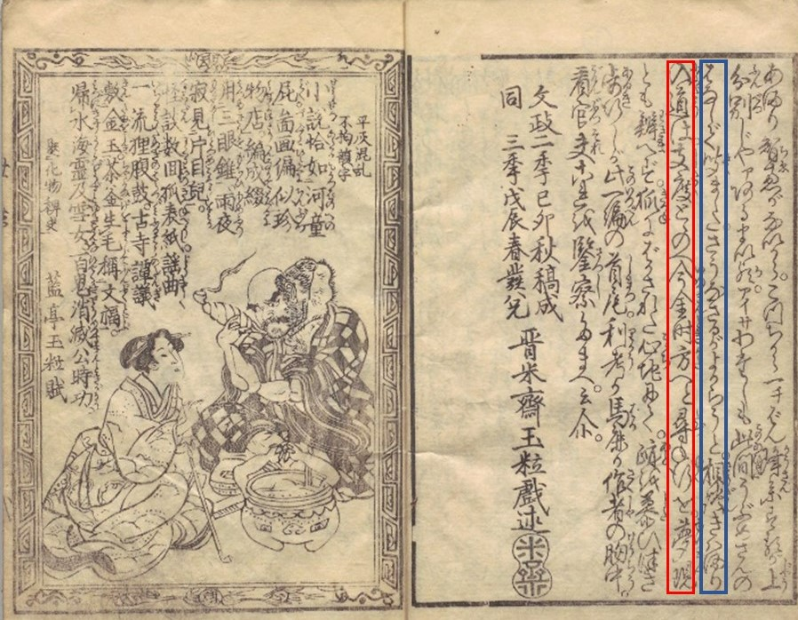

# NDL古典籍OCR学習用データセット（みんなで翻刻加工データ）

国立国会図書館が開発した、古典籍資料を対象としたOCR処理プログラム（[NDL古典籍OCR](https://github.com/ndl-lab/ndlkotenocr_cli)）の教師データとして構築したOCR学習用データセットです。

CC BY-SA 4.0ライセンスで提供されている、[みんなで翻刻データ](https://github.com/yuta1984/honkoku-data)を機械学習用に加工しています。


## データセットのURL

https://lab.ndl.go.jp/dataset/ndlkotensekiocr/ndl-minhon-ocrdataset.zip (30MB)


## データセットの説明

みんなで翻刻データは、歴史資料の市民参加型翻刻プラットフォーム[みんなで翻刻](https://honkoku.org/)上で翻刻されたテキストデータです。

翻刻データの作成対象の大部分は、江戸期以前の和古書、清代以前の漢籍といった古典籍資料であり、現代の日本語利用者の多くが判読することの困難な文字情報を豊富に含んでいます。

このみんなで翻刻データは、資料画像中に含まれる文字列の1行ごとに改行を挿入した、座標情報を持たないテキストファイルとして提供されており、そのままではOCRの学習用データセットとして活用することは困難です。

国立国会図書館は、2021年度に[令和3年度OCR処理プログラム研究開発事業](https://lab.ndl.go.jp/data_set/ocr/r3_software/)を実施し、
その成果物である明治期以降に出版された活字のデジタル化資料をテキスト化することのできるOCR処理プログラムを、
[NDLOCR](https://github.com/ndl-lab/ndlocr_cli)と称してCC BYライセンスで公開しています。

このNDLOCRの開発を実施する過程で得た知見とこれまでの調査研究によって得た知見を組み合わせることで、みんなで翻刻データに対して翻刻対象画像における座標情報を紐づける構造化を行い、
古典籍資料をテキスト化するOCR処理プログラムの学習用データセットを作成しました。

## データセットの構造情報
みんなで翻刻のプラットフォームのリニューアルにより、リニューアル前（v1）とリニューアル後（v2）でみんなで翻刻データ側の提供メタデータの形式が異なるため、
v1とv2を分けて作成しています。

2023年1月現在の数量は、v1について4,688画像から66,537行分、v2について24,055画像から285,869行分の合計352,406行分です。

### 構造化情報（json形式）

次に挙げる例は、

晋米齋玉粒 作 ほか『化物世帯氣質』,春松軒西宮新六,文政3 [1820]. 国立国会図書館デジタルコレクション https://dl.ndl.go.jp/pid/10301810 (参照 2023-01-19)

の4コマ目(https://dl.ndl.go.jp/pid/10301810/1/4
)

についてみんなで翻刻データ(https://github.com/yuta1984/honkoku-data/blob/master/v2/kusazoushi/9D61092EC482751E687C188D44347857/004.txt
)を構造化した結果の一部です。


```
[
  {
    "boundingBox": [ #<- みんなで翻刻データの翻訳対象画像上の四隅の座標が格納される
      [
        3805,
        631
      ],
      [
        3805,
        2891
      ],
      [
        3930,
        631
      ],
      [
        3930,
        2891
      ]
    ],
    "id": 8,
    "isVertical": "true",
    "text": "はなしで聞ました。さうなさるがよからうと。相談きはまり", #<- みんなで翻刻データの1行単位のテキストデータが格納される
    "isTextline": "true",
    "confidence": 1
  },
  {
    "boundingBox": [
      [
        3653,
        629
      ],
      [
        3653,
        2887
      ],
      [
        3810,
        629
      ],
      [
        3810,
        2887
      ]
    ],
    "id": 2,
    "isVertical": "true",
    "text": "入道は。支度とゝのへ今金時方へと尋ね行を。夢現",
    "isTextline": "true",
    "confidence": 1
  },
・・・

```

次の図は、翻刻対象画像におけるそれぞれの翻刻データの位置座標を示しています。「はなしで聞ました。さうなさるがよからうと。相談きはまり」が図中の青い枠、「入道は。支度とゝのへ今金時方へと尋ね行を。夢現」が図中の赤い枠に対応しています。



### v1のディレクトリ構造

v1ディレクトリの直下に対象資料のID（Book ID）のディレクトリがあり、その下にページごとの構造化情報の含まれたjsonファイルが格納されています。

```
v1
├── L000001
│?? ├── 000005725.json
│?? ├── 000005726.json
│?? ├── 000005727.json
│?? ├── 000005728.json
│?? ・・・
│?? └── 000005756.json
├── L000002
├── L000003
├── L000004
├── L000005
│・・・
├── L001185
├── L001186
└── L001197
```

### v2のディレクトリ構造
v2ディレクトリの直下に対象プロジェクトのID（Project ID）のディレクトリがあり、対象資料のID（Book ID）のディレクトリがあり、その下にページごとの構造化情報の含まれたjsonファイルが格納されています。
```
v2
├── dafukui
│?? ├── 2BF51C1013B0054BBDA0EF83CF8A8A96
│?? │?? ├── 001.json
│?? │?? ├── 002.json
│?? │??・・・
│?? │??
│?? ・・・
│?? └── FF248BFF120D22FEA1F762DF874B3430
├── discovery
│・・・
├── ryukyu
├── tokushima
└── zisin
```

## メタデータの情報
いずれもみんなで翻刻データから提供されているメタデータを加工整形したもので、カンマ区切りのcsv形式です。データセットのzipファイル内にも同梱しています。

### v1のメタデータ情報
ダウンロード：[v1_metadata.csv](./v1_metadata.csv)

左列から、

* Book ID: 資料ID（みんなで翻刻における当該資料の管理ID）
* Book Name：資料タイトル
* Arrtibution：資料画像の所蔵機関情報
* File ID(Minna De Honkoku)：みんなで翻刻データにおける当該翻刻データファイル名
* File ID(NDL)：みんなで翻刻データにおける画像ファイル名（※v1は翻刻データ名と画像ファイル名が一致しないため、本データセットでは画像ファイル名で統一している）
* Image URL：画像のURL（フルサイズ）
* GitHub URL みんなで翻刻データのGitHubリポジトリ(https://github.com/yuta1984/honkoku-data)における翻刻テキストの格納場所

の情報を含みます。下記に例を抜粋して示します。
|Book ID|Book Name|Attribution|File ID(Minna De Honkoku)|File ID(NDL)|Image URL|GitHub URL|
|:----|:----|:----|:----|:----|:----|:----|
|L000001|地震年代記|東京大学地震研究所図書室|001|000005725|http://wwweic.eri.u-tokyo.ac.jp/dl/cont/01/G0000002erilib/000/005/000005725.jpg|https://github.com/yuta1984/honkoku-data/tree/master/v1/L000001|
|L000001|地震年代記|東京大学地震研究所図書室|002|000005726|http://wwweic.eri.u-tokyo.ac.jp/dl/cont/01/G0000002erilib/000/005/000005726.jpg|https://github.com/yuta1984/honkoku-data/tree/master/v1/L000001|
|L000001|地震年代記|東京大学地震研究所図書室|003|000005727|http://wwweic.eri.u-tokyo.ac.jp/dl/cont/01/G0000002erilib/000/005/000005727.jpg|https://github.com/yuta1984/honkoku-data/tree/master/v1/L000001|
|L000001|地震年代記|東京大学地震研究所図書室|004|000005728|http://wwweic.eri.u-tokyo.ac.jp/dl/cont/01/G0000002erilib/000/005/000005728.jpg|https://github.com/yuta1984/honkoku-data/tree/master/v1/L000001|


### v2のメタデータ情報

ダウンロード：[v2_metadata.csv](./v2_metadata.csv)

左列から、

* Project ID:プロジェクトID（みんなで翻刻における当該プロジェクトの管理ID）
* Book ID: 資料ID（みんなで翻刻における当該資料の管理ID）
* Book Name：資料タイトル
* Arrtibution：資料画像の所蔵機関情報
* File ID(Minna De Honkoku)：当該翻刻データ及び画像ファイル名
* Image URL：画像のURL（フルサイズ）
* GitHub URL みんなで翻刻データのGitHubリポジトリ(https://github.com/yuta1984/honkoku-data)における翻刻テキストの格納場所

の情報を含みます。下記に例を抜粋して示します。

|Project ID|Book ID|Book Name|Arrtibution|File ID(Minna De Honkoku)|Image URL|GitHub URL|
|:----|:----|:----|:----|:----|:----|:----|
|kusazoushi|9D61092EC482751E687C188D44347857|化物世帯氣質|国立国会図書館 National Diet Library|001|https://www.dl.ndl.go.jp/api/iiif/10301810/R0000001/full/full/0/default.jpg|https://github.com/yuta1984/honkoku-data/tree/master/v2/kusazoushi/9D61092EC482751E687C188D44347857|
|kusazoushi|9D61092EC482751E687C188D44347857|化物世帯氣質|国立国会図書館 National Diet Library|002|https://www.dl.ndl.go.jp/api/iiif/10301810/R0000002/full/full/0/default.jpg|https://github.com/yuta1984/honkoku-data/tree/master/v2/kusazoushi/9D61092EC482751E687C188D44347857|
|kusazoushi|9D61092EC482751E687C188D44347857|化物世帯氣質|国立国会図書館 National Diet Library|003|https://www.dl.ndl.go.jp/api/iiif/10301810/R0000003/full/full/0/default.jpg|https://github.com/yuta1984/honkoku-data/tree/master/v2/kusazoushi/9D61092EC482751E687C188D44347857|
|kusazoushi|9D61092EC482751E687C188D44347857|化物世帯氣質|国立国会図書館 National Diet Library|004|https://www.dl.ndl.go.jp/api/iiif/10301810/R0000004/full/full/0/default.jpg|https://github.com/yuta1984/honkoku-data/tree/master/v2/kusazoushi/9D61092EC482751E687C188D44347857|


## 利用方法
srcディレクトリ内に、サンプルとしてPythonによる処理プログラムを配置しています。

Python 3.8以降に対応しています。必要なライブラリについては[requirements.txt](./src/requirements.txt)を参照してください。


### 1. 事前準備

データセットのzipファイルを展開し、同じディレクトリに、srcディレクトリ内のファイルを配置してください。

### 2. 画像のダウンロード
v1の画像をダウンロードする場合は次の通りです。(img_v1ディレクトリが作成され、画像がダウンロードされます。)
```
python3 imgdownloader.py v1
```
v2をダウンロードする場合は次の通りです。(img_v2ディレクトリが作成され、画像がダウンロードされます。)
```
python3 imgdownloader.py v2
```

### 3. 1行データセットの作成
v1から作成する場合は次の通りです。(honkoku_oneline_v1ディレクトリが作成され、ディレクトリ直下に1行単位に切り分けられたjpgファイルとtxtファイルが同名で出力されます。)
```
python3 makeonelinedataset.py v1
```
v2から作成する場合は次の通りです。(honkoku_oneline_v2ディレクトリが作成され、ディレクトリ直下に1行単位に切り分けられたjpgファイルとtxtファイルが同名で出力されます。)
```
python3 makeonelinedataset.py v2
```


## 注意点

* みんなで翻刻データの行単位のテキストデータと翻刻対象画像各行の位置座標の対応付けは機械的に行っており、対応関係の誤りや、対応漏れが含まれます。

* 対応関係の誤りの発生を抑えるため、確実性の高い対応関係のみを紐づけています。つまり、翻刻対象画像上のすべての文字列と翻刻データの各行が漏れなく対応づいていることはほとんどありません。

* 利用方法の項で記載した通り、翻刻対象画像から文字列画像を行単位に切り出したうえで、1行単位で利用することを推奨します。


